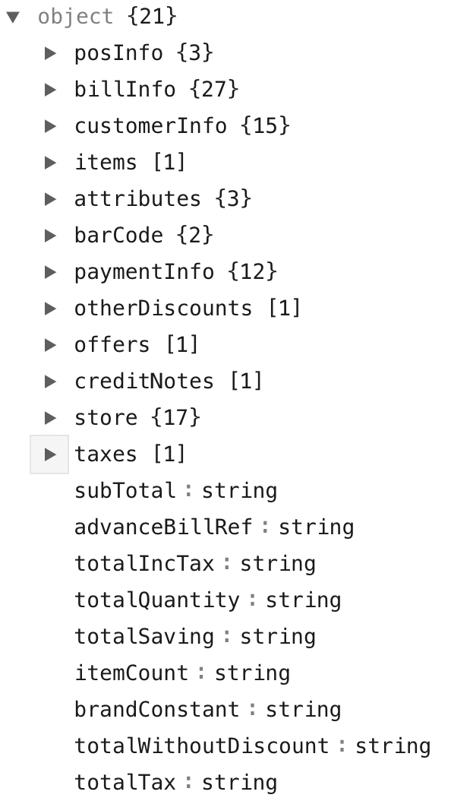

# Bill Posting API

## Rest URL

```
POST https://sandbox.kbill.in/api/v1/bills
```

## Request Headers

```
    Content-Type: application/json
    Accept: application/json
    Authorization: {brand-key}
```

The brand key is shared in a seperate email.

## Request Body in JSON


```json
 {
  "posInfo": {
    "posNumber": "string",
    "userId": "string",
    "userName": "string"
  },
  "billInfo": {
    "billNumber": "string",
    "billStatus": "string",
    "billType": "string",
    "purchaseDate": "string",
    "purchaseTime": "string",
    "comfortCallDate": "string",
    "comfortCallTime": "string",
    "linkedBill": "string",
    "salesOrderNumber": "string",
    "fittingCharges": "string",
    "placeOfSupply": "string",
    "salesChannel": "string",
    "employeeId": "string",
    "employeeName": "string",
    "transactionNumber": "string",
    "invoiceReferenceNumber": "string",
    "dynamicQrCode": "string",
    "trackingNo": "string",
    "courierBookingDate": "string",
    "courierName": "string",
    "expectedDeliveryDate": "string",
    "linkedBillDateTime": "string",
    "salesOrderDateTime": "string",
    "courierReferenceNo": "string",
    "courierDestination": "string",
    "attributes": {
      "additionalProp1": "string",
      "additionalProp2": "string",
      "additionalProp3": "string"
    },
    "invoiceAddresses": [
      {
        "address1": "string",
        "address2": "string",
        "address3": "string",
        "addressType": "string",
        "area": "string",
        "buildingNo": "string",
        "country": "string",
        "customerID": "string",
        "email": "string",
        "firstName": "string",
        "flatNo": "string",
        "lastName": "string",
        "middleName": "string",
        "phone1": "string",
        "phone2": "string",
        "postalCode": "string",
        "region": "string",
        "state": "string",
        "city": "string",
        "stateCode": "string",
        "taxCertificate": "string"
      }
    ]
  },
  "customerInfo": {
    "customerAddress": {
      "addressString": "string",
      "city": "string",
      "country": "string",
      "description": "string",
      "landmark": "string",
      "latitude": 0,
      "longitude": 0,
      "pincode": 0,
      "state": "string",
      "stateCode": "string"
    },
    "customerEmail": "string",
    "customerId": "string",
    "customerName": "string",
    "customerLastName": "string",
    "customerFirstName": "string",
    "customerGender": "string",
    "customerSalutation": "string",
    "anniversary": "string",
    "dob": "string",
    "customerNumber": "string",
    "customerGstn": "string",
    "loyaltyDescription": "string",
    "loyaltyNumber": "string",
    "attributes": {
      "additionalProp1": "string",
      "additionalProp2": "string",
      "additionalProp3": "string"
    }
  },
  "items": [
    {
      "lineitemno": "string",
      "brand": "string",
      "code": "string",
      "description": "string",
      "itemBarcode": "string",
      "mrp": "string",
      "sellingPrice": "string",
      "quantity": "string",
      "uom": "string",
      "serialNumber": "string",
      "expiryDate": "string",
      "categoryId": "string",
      "categoryName": "string",
      "productType": "string",
      "subcategoryId": "string",
      "subcategoryName": "string",
      "itemColor": "string",
      "itemSize": "string",
      "multiDiscounts": [
        {
          "discountableAmount": "string",
          "percentage": "string",
          "amount": "string",
          "description": "string",
          "discountRefNo": "string",
          "discountType": "string",
          "attributes": {
            "additionalProp1": "string",
            "additionalProp2": "string",
            "additionalProp3": "string"
          }
        }
      ],
      "amount": "string",
      "hsnCode": "string",
      "taxes": [
        {
          "taxableAmount": "string",
          "code": "string",
          "description": "string",
          "percentage": "string",
          "totalIncTax": "string",
          "amount": "string"
        }
      ],
      "approverInfo": {
        "approverName": "string"
      },
      "attributes": {
        "additionalProp1": "string",
        "additionalProp2": "string",
        "additionalProp3": "string"
      },
      "deliveryDate": "string",
      "deliveryType": "string",
      "warrantyInfo": {
        "serial": "string",
        "description": "string",
        "validity": "string",
        "warrantyTimeUnit": "string",
        "endDate": "string"
      }
    }
  ],
  "attributes": {
    "billMode": "string",
    "additionalProp2": "String",
    "additionalProp3": "string"
  },
  "barCode": {
    "attributes": {
      "additionalProp1": "string",
      "additionalProp2": "string",
      "additionalProp3": "string"
    },
    "code": "string"
  },
  "paymentInfo": {
    "paidAmount": "string",
    "paidAmountInWords": "string",
    "totalTender": "string",
    "roundoff": "string",
    "roundedOffAmount": "string",
    "changeDue": "string",
    "paymentStatus": "string",
    "baseCurrency": "string",
    "netDue": "string",
    "balanceAmount": "string",
    "advanceAmount": "string",
    "paymentMode": [
      {
        "amount": "string",
        "mode": "string",
        "code": "string",
        "accountNumber": "string",
        "subTenderType": "string",
        "currency": "string",
        "currencyCode": "string",
        "currencyAmount": "string",
        "exchangeRate": "string",
        "quantityOfCurrency": "string",
        "authorizationCode": "string",
        "transactionNo": "string",
        "paymentStatus": "string",
        "paymentType": "string",
        "details": {
          "additionalProp1": "string",
          "additionalProp2": "string",
          "additionalProp3": "string"
        }
      }
    ]
  },
  "otherDiscounts": [
    {
      "amount": "string",
      "attributes": {
        "additionalProp1": "string",
        "additionalProp2": "string",
        "additionalProp3": "string"
      },
      "description": "string",
      "discountableAmount": "string",
      "discountRefNo": "string",
      "discountType": "string",
      "percentage": "string"
    }
  ],
  "offers": [
    {
      "amount": "string",
      "campaignId": "string",
      "code": "string",
      "description": "string",
      "discountId": "string",
      "type": "string",
      "validFrom": "string",
      "validTill": "string"
    }
  ],
  "creditNotes": [
    {
      "amount": "string",
      "code": "string",
      "description": "string",
      "type": "string",
      "validFrom": "string",
      "validTill": "string"
    }
  ],
  "store": {
    "storeId": "string",
    "displayName": "string",
    "city": "string",
    "state": "string",
    "displayAddress": {
      "addressString": "string",
      "city": "string",
      "country": "string",
      "description": "string",
      "landmark": "string",
      "latitude": 0,
      "longitude": 0,
      "pincode": 0,
      "state": "string",
      "stateCode": "string"
    },
    "storeName": "string",
    "zone": "string",
    "officialEmail": "string",
    "fax": "string",
    "gstin": "string",
    "primaryContactNumber": "string",
    "registeredAddress": {
      "addressString": "string",
      "city": "string",
      "country": "string",
      "description": "string",
      "landmark": "string",
      "latitude": 0,
      "longitude": 0,
      "pincode": 0,
      "state": "string",
      "stateCode": "string"
    },
    "registeredName": "string",
    "customerCareEmail": "string",
    "customerCareNumber": "string",
    "secondaryContactNumbers": [
      "string"
    ],
    "attributes": {
      "additionalProp1": "string",
      "additionalProp2": "string",
      "additionalProp3": "string"
    }
  },
  "taxes": [
    {
      "amount": "string",
      "code": "string",
      "description": "string",
      "percentage": "string",
      "totalIncTax": "string",
      "taxableAmount": "string"
    }
  ],
  "subTotal": "string",
  "advanceBillRef": "string",
  "totalIncTax": "string",
  "totalQuantity": "string",
  "totalSaving": "string",
  "itemCount": "string",
  "brandConstant": "string",
  "totalWithoutDiscount": "string",
  "totalTax": "string"
}
```
## Understanding API Structure

This API has the following objects:-




| Name of the oject      | Purpose                                                                                                                                                                                                                                          |
| ---------------------- | ------------------------------------------------------------------------------------------------------------------------------------------------------------------------------------------------------------------------------------------------ |
| `posInfo`              | POS and Information about the Cashier at point of sale `posNumber` - POS terminal Identification Number.  `userId` - user ID of logged-in user`userName` - User name of logged in user.                                                          |
| `billInfo`             | It contains all the fields that is needed to create a bill. Apart from that it also contains linked bills in case of return against a previous bill, shipment info and courier details.                                                          |
| `customerInfo`         | It contains the fields related to customer information and loyalty programs related to that customer.                                                                                                                                            |
| `item`                 | This is an array of items that need to be shown in the bill. In this object, you specify the details needed against each object ranging from adjectives to price to discounts and taxes etc.                                                     |
| `attributes`           | These are msicellaneous informations that are optional to be sent. These attributes are to be discussed with the executive.                                                                                                                      |
| `barCode`              | This is the barcode information on the bill basis.                                                                                                                                                                                               |
| `paymentInfo`          | This object relates to payment information completed by the customer. It can be online payment, on site payment,etc.                                                                                                                             |
| `otherDiscount`        | This object contains the information of discounts that is applied on bill level i.e. on total amount.                                                                                                                                            |
| `offers`               | `offers` object is contains information for advertising potential discount/product offers.                                                                                                                                                       |
| `creditNotes`          | This is information of amount of credits that a user. For example, if a user returns an item, instead of giving money back, credits can be alloted to that user for future use on the brand. That information needs to be passed in this object. |
| `store`                | This object contains the information of the specific store the bill is generated from. For example, store name, address, cotact etc.                                                                                                             |
| `taxes`                | This object contains the information of taxes that are applied on bill level, i.e it affects the total amount and all the items.                                                                                                                 |
| `subTotal`             | This field is used to specify the total without including tax                                                                                                                                                                                    |
| `advanceBillRef`       | This field contains the reference to the advance bill in case it was generated.                                                                                                                                                                  |
| `totalIncTax`          | This field contains the amount to be finally paid by the customer.                                                                                                                                                                               |
| `totalQuantity`        | Thsi fields contains the total quantity of items that was purchased                                                                                                                                                                              |
| `itemCount`            | This field depicts the total number of unique items purchased                                                                                                                                                                                    |
| `totalSaving`          | This is amount that customer has saved after applying discount.                                                                                                                                                                                  |
| `totalWithoutDiscount` | This is the amount before bill level discount is applied                                                                                                                                                                                         |
| `brandConstant`        | This is a unique identification for a brand, could be brand name or brand code.(to prevent wrong data flow)                                                                                                                                      |

:::note 
For information on every field, visit this link **[Deep Dive](Deep%20Dive.md)**
:::

## Responses

### HTTP Status Code 201

In this case, the bill gets created at the Karnival side. The notifications are sent according to the parameters passed in the request.

In case the phone number and email are passed in the request body, the notification will be sent on both of them. The response body will be:-

```json
{
   "status": "success",
   "message": "Entity has been saved.",
   "responseCode": 200,
   "params": {
       "entity.id": "5f3102376f10e83a65c0a03c",
       "bill.url": "https://***.knvl.me/az/*********"
   },
   "mobileValid": true,
   "emailValid": true
}
```

In case there is no email passed in request body(or if invalid email) but phone number is, the notification is sent as sms. The response body will be:-

```json
{
   "status": "success",
   "message": "Entity has been saved.",
   "responseCode": 12,
   "params": {
       "entity.id": "5f3102376f10e83a65c0a03c",
       "bill.url": "https://***.knvl.me/az/*********"
   },
   "mobileValid": true,
   "emailValid": false
}
```

In case there is no phone number passed in request body(or if number invalid) but email is, the notification is sent as email. The response body will be:-

```json
{
   "status": "success",
   "message": "Entity has been saved.",
   "responseCode": 11,
   "params": {
       "entity.id": "5f3102376f10e83a65c0a03c",
       "bill.url": "https://***.knvl.me/az/*********"
   },
   "mobileValid": false,
   "emailValid": true
}
```

In case both email and phone number are invalid or not passed, no notification will be sent. The response body is:-

```json
{
   "status": "success",
   "message": "Entity has been saved.",
   "responseCode": 13,
   "params": {
       "entity.id": "5f3102376f10e83a65c0a03c",
       "bill.url": "https://***.knvl.me/az/*********"
   },
   "mobileValid": false,
   "emailValid": false
}
```

In case brandConstant is invaild, the response body will be:-

```json
{
   "status": "success",
   "message": "Entity has been saved with brand constant mismatch",
   "responseCode": 30,
   "params": {
       "entity.id": "61a72c89fdd2034dfc2c78a6"
   },
   "mobileValid": true,
   "emailValid": true
}
```

#### Response Codes

| Code Number  | Description   |
| --- | ---------- |
|11 |    If mobile number provided in request is invalid|
|12 |    If email id provided in request is invalid|
|13 |    If mobile number and email id both provided in request are invalid|
|30 |    Brand Agreed Constant and BrandConstant in Bill are different|
|200|    No error|

### HTTP Status Code 208

This status code means that the bill number that is passed in request body is already created on Karnival side. A quick solution is to use a different bill number.

```json
{
   "status": "failed",
   "message": "Bill has already been posted on Server.",
   "responseCode": 208
}
```

### HTTP Status Code 401

This status code signifies that the request made is unauthorized. This happens when Authorization Key is missing in headers.

```json
{
   "status": "failed",
   "message": "Bill Request does not have a valid Authentication Key",
   "responseCode": 401
}

```

### HTTP Status Code 400

This happens when you don't send mandatory fields in request body.

#### Missing Store ID

```json
{
   "status": "failed",
   "message": "Store Id must be present",
   "responseCode": 10
}
```

#### Missing BillNumber and Sales Order Number

```json
{
   "status": "failed",
   "message": "Bill Number or Sales Order Number must be present",
   "responseCode": 40
}
```

#### Response Codes

| Code Number  | Description   |
| --- | ---------- |
|10 |     If store id is missing from request|
|40 |   Bill Number and SalesOrder Number, both are missing from request|